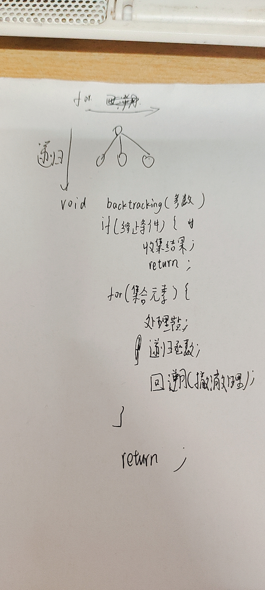
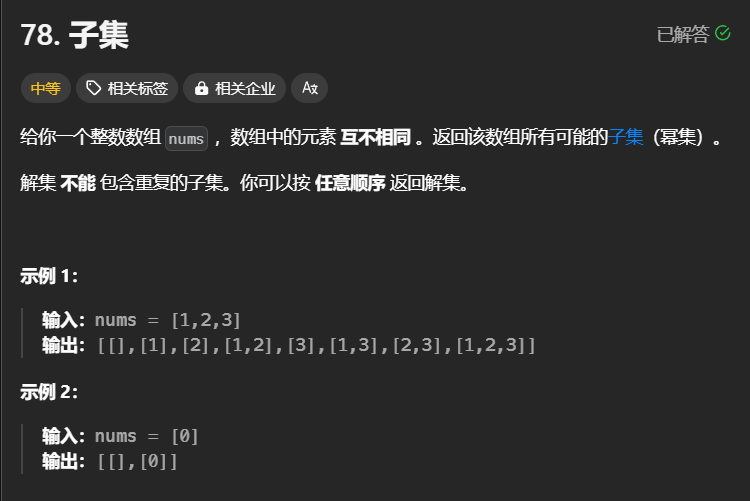
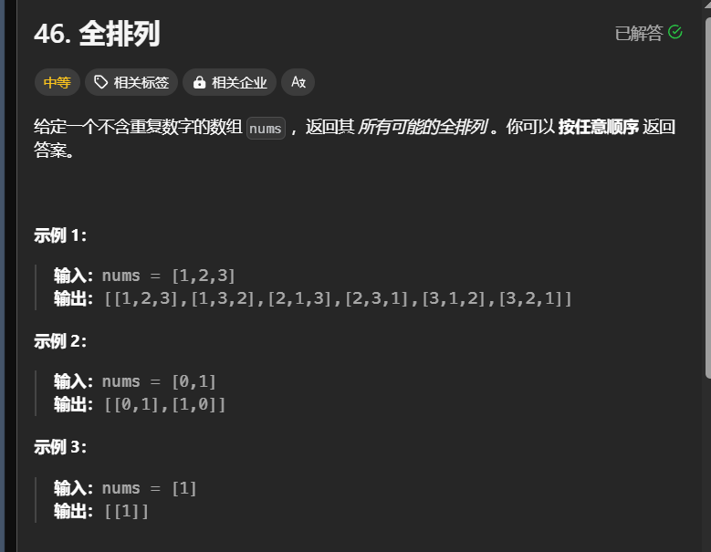
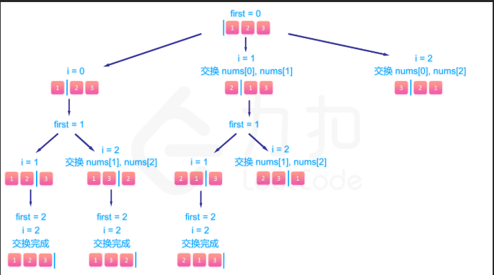

# 子集

```c++
class Solution {
public:
    vector<int> path;
    vector<vector<int>> result;
    vector<vector<int>> subsets(vector<int>& nums) {
        int n=nums.size();
        dfs(nums,path,0);
        return result;
    }
    void dfs(vector<int>& nums,vector<int> path,int pos){
        result.push_back(path);
        if(pos==nums.size()){
            return ;
        }
        for(int i=pos;i<nums.size();++i){
            path.push_back(nums[i]);
            dfs(nums,path,++pos);
            path.pop_back();

        }
    }
};
```
# 全排列

```c++
class Solution {
public:

    vector<vector<int>> permute(vector<int>& nums) {
        vector<vector<int> > res;
        backtrace(res,nums, 0,(int)nums.size());
        return res;
    }
    void backtrace(vector<vector<int>>& res,vector<int>& cur_array,int first,int len){
        if(first==len){//first是已经填完的位置数
            res.emplace_back(cur_array);
            return;
        }
        for(int i=first;i<len;i++){
            swap(cur_array[first],cur_array[i]);//构造第first个填完的数
            backtrace(res,cur_array,first+1,len);
            swap(cur_array[first],cur_array[i]);//剪枝
        }

    }
};
```
