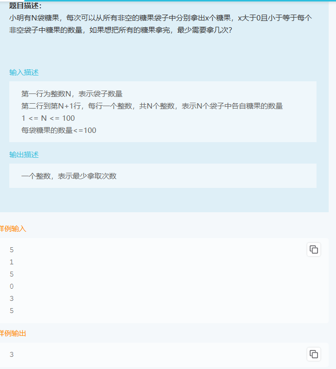

# 1

```cpp
#include <iostream>
#include <string>
#include <stack>
#include <vector>
using namespace std;

int main() {
    // 输入的字符
    vector<char> words;
    char word;
    // 读取输入，直到到达 EOF
    while (cin >> word) {
        words.push_back(word);
    }

    // 栈用于处理成对消除的字符
    stack<char> Num_stack;
    // 遍历输入字符
    for (int i = 0; i < words.size(); i++) {
        if (!Num_stack.empty() && words[i] == Num_stack.top()) {
            Num_stack.pop(); // 消除成对字符
        } else {
            Num_stack.push(words[i]); // 压入栈
        }
    }

    // 提取未被消除的字符
    vector<char> result;
    while (!Num_stack.empty()) {
        result.push_back(Num_stack.top());
        Num_stack.pop();
    }

    // 由于最终字符保存在栈中，顺序需要反转
    for (int i = result.size() - 1; i >= 0; --i) {
        cout << result[i];
    }
    return 0;
}
```
# 2


```cpp
#include <iostream>
#include <vector>
#include <unordered_set>
using namespace std;

class Solution {
public:
    long long matrixSum(int n, vector<vector<int>>& operations) {
        // 记录已经操作过的行和列
        unordered_set<int> modifiedRows, modifiedCols;
        long long result = 0;

        // 从最后一个操作逆向执行
        for (int i = operations.size() - 1; i >= n; i--) {
            int type = operations[i][0];
            int index = operations[i][1];
            int value = operations[i][2];

            if (type == 0 && modifiedRows.count(index) == 0) { // 行操作
                result += (long long)value * (n - modifiedCols.size());
                modifiedRows.insert(index);
            }

            if (type == 1 && modifiedCols.count(index) == 0) { // 列操作
                result += (long long)value * (n - modifiedRows.size());
                modifiedCols.insert(index);
            }
        }

        return result;
    }
};

int main() {
    long long res;

    int n;
    cin >> n;

    int operations_rows, operations_cols;
    cin >> operations_rows >> operations_cols;
    vector<vector<int>> operations(operations_rows, vector<int>(operations_cols));

    for (int i = 0; i < operations_rows; i++) {
        for (int j = 0; j < operations_cols; j++) {
            cin >> operations[i][j];
        }
    }

    Solution s;
    res = s.matrixSum(n, operations);
    cout << res;

    return 0;
}
```
代码说明
变量 modifiedRows 和 modifiedCols：

用来记录已经修改过的行或列，避免重复考虑。
逆序遍历 operations：

从最后一个操作开始向前执行，能够保证优先级更高的操作被优先计算。
避免重复计算：

每次操作只针对未修改的行或列进行计算，极大地减少了重复计算。
时间复杂度分析：

由于只需标记并操作未修改的行或列，总的时间复杂度降为 ，
其中  为矩阵的边长， 为操作数量。

# 3

```cpp
#include <iostream>
#include <vector>
#include <algorithm>
using namespace std;

void Tanxin(vector<int>& array, int& result, int len) {
    sort(array.begin(), array.end()); // 先对糖果数组升序排序
    for (int i = 0; i < len; ++i) {
        if (array[i] > 0) { // 如果当前的袋子还有糖果
            int minValue = array[i]; // 找到当前非空袋的最小值
            for (int j = i; j < len; ++j) {
                array[j] -= minValue; // 所有袋减去这个最小值
            }
            result += 1; // 记录操作次数
        }
    }
}

int main() {
    int numofcandy;
    cin >> numofcandy;              // 输入糖果袋子的个数
    vector<int> array(numofcandy); // 初始化糖果袋数组
    int result = 0;

    for (int i = 0; i < numofcandy; ++i) {
        cin >> array[i]; // 输入每个袋子中的糖果数量
    }

    Tanxin(array, result, numofcandy); // 调用贪心算法处理
    cout << result;                    // 输出最少需要的次数
    return 0;
}
```
# 4

