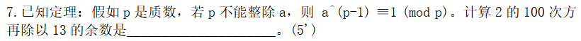

核心思想
1. 选定一个点，这个点满足两个条件：1.未被选过，2.距离最短

2. 对于这个点的所有邻近点去尝试松弛

首先，可以设置两个集合分别是A和B，A用来存放已经求出最短路径的点，B用来存放还未计算出最短路径的点

```c++
const int inf = 500;  //可以给别的值，只要大于图中任何一边的距离即可
vector<int> dijkstra(vector<vector<int> > G,int source)
{
    int n = G.size(); //n代表图的顶点个数
    vector<int> dis(n,inf); //dis代表源点到其它点的最短距离，inf代表无穷，初始化vector
    vector<int> vis(n,false); //vis代表某个顶点是否被访问过，初始化所有的顶点为false
    //源点到源点的距离为0
    dis[source]=0;
    
    /*
        根据前面咱们的分析可以知道，要不断寻找没有被访问过且距离源点最近的点，有n个顶点，
        就要寻找n-1次，找到点之后，对其邻接点进行松弛，为什么只要寻找n-1个点呢？因为当
        剩下一个点的时候，这个点已经没有需要松弛的邻接点了。此时从源点到这个点的距离就是最短距离了。
    */
    //可以使用一个for循环，循环n-1次，来寻找n-1个点
    for(int i=0; i<n-1; i++)
    {
        int node = -1;  //进入循环之后，假设一开始不知道哪个是没有被访问过且距离源点最短的点
        for(int j=0;j<n;j++)  //使用这个循环开始寻找没有被访问过且距离源点最短距离的点
        {
            if(!vis[j] && (node == -1 || dis[j]<dis[node]))
            {
                node = j;  //把当前距离源点最短距离的点给node
            }
        }
        //对这个距离源点最短距离的点的所有邻接点进行松弛
/*逻辑：
假设已经找到一个距离源点最近的点node，对所有未访问的邻接点j进行松弛。
松弛公式：dis[j] = min(dis[j], dis[node] + G[node][j])
更新从源点到j的最短路径：
如果走node经过边G[node][j]的路径更短，则更新dis[j]。
将node标记为已访问*/
        for(int j=0; j<n; j++)

        {
            dis[j]=min(dis[j],dis[node]+G[node][j]);//G[node][j] 表示的是图中顶点 node 到它的邻接顶点 j 的权重（距离）
            /*
                这边要特别注意：对于不是node的邻接点并不会影响它原来的距离，以2点为例
                对于邻接的已经访问过的点也不会产生影响，以3点为例
            */
        }
        //标记为已访问过
        vis[node] = true;;
    }
    return dis;
}
```