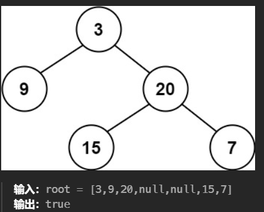
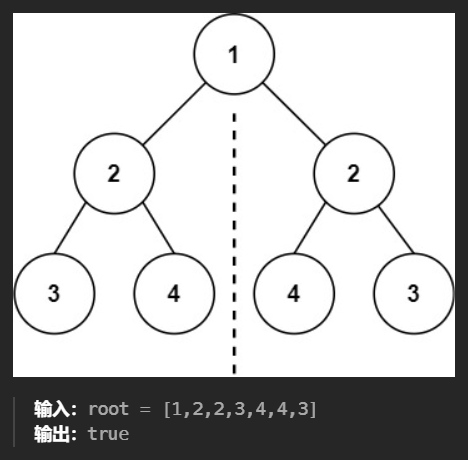
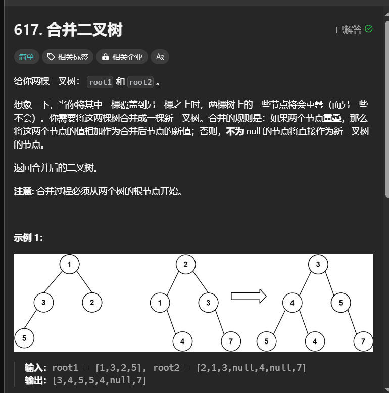
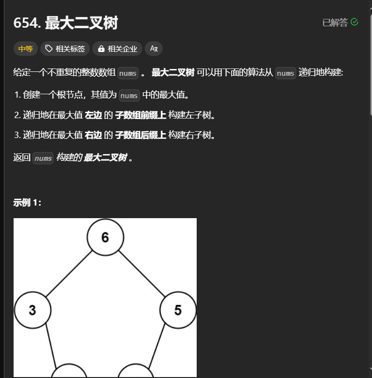

# 解递归题的三部曲：

找整个递归的终止条件：递归应该在什么时候结束？
找返回值：应该给上一级返回什么信息？
本级递归应该做什么：在这一级递归中，应该完成什么任务？
## 平衡二叉树

```c++
class Solution {
public:
    int height(TreeNode* root){
        if(root==NULL)
            return 0;
        else {
            return max(height(root->left), height(root->right)) + 1;
        }
    }
    bool isBalanced(TreeNode* root) {
        if(root==NULL)
            return true;
        else{
            return abs(height(root->left) - height(root->right)) <= 1 && isBalanced(root->left) && isBalanced(root->right);}
    }

};
```
## 对称二叉树

```c++
class Solution {
public:
    bool isSymmetric(TreeNode* root) {
        if(!root) return true;
        return isMirror(root->left,root->right);
    }
    bool isMirror(TreeNode* L1,TreeNode* L2){
        if(!L1&&!L2) return true;
        if(!L1||!L2) return false;
        if(L1->val!=L2->val) return false;
        return isMirror(L1->left,L2->right)&&isMirror(L1->right,L2->left);

    }
};
```
## 合并二叉树

```c++
class Solution {
public:
    TreeNode* mergeTrees(TreeNode* root1, TreeNode* root2) {
        if(!root1){
            return root2;
        }
        if(!root2){
            return root1;
        }
        auto mergeone=new TreeNode(root1->val+root2->val);
        mergeone->left=mergeTrees(root1->left,root2->left);
        mergeone->right = mergeTrees(root1->right, root2->right);
        return mergeone;
    }
};
```
## 二叉树三顺序遍历
### 前序遍历
```c++
class Solution {
    vector<int> result;
public:
    vector<int> preorderTraversal(TreeNode* root) {
        
        if(root==nullptr)
            return vector<int>();        
        result.push_back(root->val);
        preorderTraversal(root->left);

        preorderTraversal(root->right);
        return result;
    }
};
```
其他几个后序中序交换result.push_back(root->val)的顺序即可

## 拆分数组
```c++
    TreeNode* constructMaximumBinaryTree(vector<int>& nums) {
        if(!nums.size()) return nullptr;
        int maxPos=finMax(nums);
        TreeNode* root=new TreeNode(nums[maxPos]);
        vector<int> leftNums(nums.begin(), nums.begin() + maxPos);//拆分数组
        vector<int> rightNums(nums.begin() + maxPos + 1, nums.end());
        root->left=constructMaximumBinaryTree(leftNums);
        root->right=constructMaximumBinaryTree(rightNums);
        return  root;
    }

```
## 

```c++
class Solution {
public:
    TreeNode* constructMaximumBinaryTree(vector<int>& nums) {
        return construct(nums, 0, nums.size() - 1);
    }

    TreeNode* construct(const vector<int>& nums, int left, int right) {
        if (left > right) {
            return nullptr;
        }
        int best = left;
        for (int i = left + 1; i <= right; ++i) {
            if (nums[i] > nums[best]) {
                best = i;
            }
        }
        TreeNode* node = new TreeNode(nums[best]);
        node->left = construct(nums, left, best - 1);
        node->right = construct(nums, best + 1, right);
        return node;
    }
};

```
## 删除表中重复元素

```c++
class Solution {
public:
    ListNode* deleteDuplicates(ListNode* head) {
        if(!head) return head;
        ListNode* cur=head;
        while(cur->next){
            if(cur->next->val==cur->val)
            cur->next=cur->next->next;
            else cur=cur->next;
        }
        return head;

    }
};
```
## 二分查找
return binary_search(row->begin(), row->end(), target);
CopyInsert
binary_search 是一个标准库算法，用于在一个有序范围内查找目标值。
row->begin() 和 row->end() 分别是找到的行的起始迭代器和结束迭代器。
如果 binary_search 找到了 target，则返回 true；否则返回 false。
