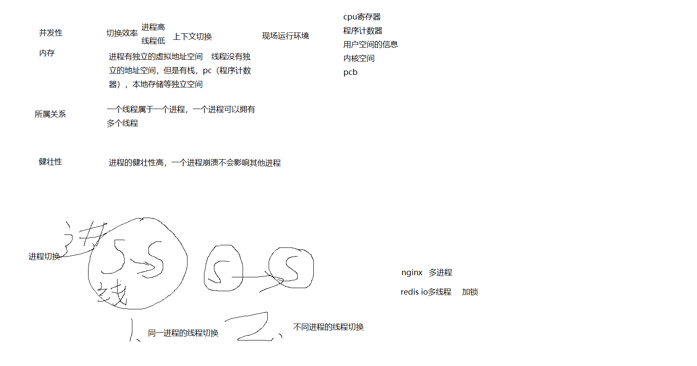

# 多态

## 1. c++内存分布：
栈区、堆区、全局区、常量区、代码区。

## 2. 多态实现原理：静态多态和动态多态。
绑定：将函数调用与函数实现分离，将函数调用与函数实现绑定在一起。
早绑定（静态）：编译器编译时已经确定对象调用的函数地址。
晚绑定（动态）：运行时确定对象调用的函数地址。
### 静态 
**编译时**，编译器根据调用函数的实际参数类型，选择调用哪个函数。

#### 函数重载
函数重载是指在同一个作用域内，对于同一个函数名，可以定义多个函数，这些函数的参数个数或参数类型不同，但函数功能相同。
*注意：不能通过返回值类型区别重载函数。*

#### 类模板和函数模版
类模板：  允许定义一一种类，根据模板参数的不同，可以生成不同的类版本。
函数模版：  允许定义一一种函数，根据模板参数的不同，可以生成不同的函数版本。

### 动态 
#### 虚函数重写：vitual关键字修饰的成员函数，在子类中可以重新定义，这样就可以实现多态。
运行时会根据对象的实际类型，调用相应的函数（派生类对象调用派生类的对应函数，基类对象调用基类的对应函数）。
#### 原理
-若使用虚函数，则为类生成虚函数表（一维顺序数组，存放虚函数地址）。
-虚函数指针在构造函数中初始化，指向虚函数表的第一个元素，虚函数指针一般占四个字节跟其他指针一样。
相同类的不同对象虚函数表不一样。

### 为什么虚类析构函数要设置为虚函数 ：避免调用不到子类对象的析构函数

### 虚类的内存区域
虚函数：代码段
虚函数表：只读代码段（常量数据区）
虚表指针：跟对象存储位置相同（堆或者栈）

## 一个对象只能有一个虚表指针吗？
虚函数表指针很虚函数表一一对应
多重继承下，可能存在多个虚表指针

# 进程和线程的区别
## 本质区别
进程：资源分配的基本单位
线程：CPU调度的基本单位
## 区别
### 并发性：
