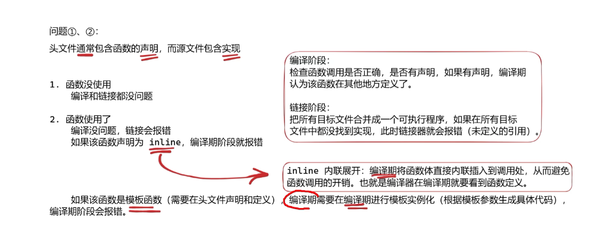
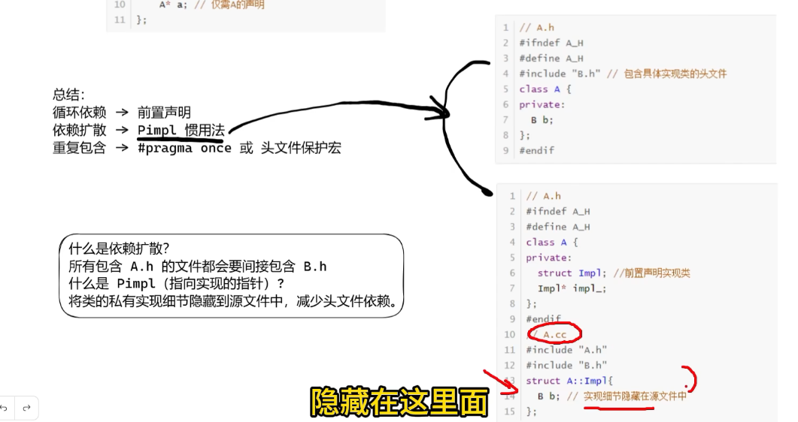

1.如果头文件创建一个函数但是源文件没有实现会有bug吗？

2.如果源文件中没有实现头文件中的函数，但是其他文件用到了该函数，会报错，吗


# 3.如何结合头文件循环包含问题

```C++
//A.h
#include "B.h"
class A{

    B* b;
};


//B
#include "A.h"
class B{

    A* a;
};
```
解决方式：前置声明
当类/结构体仅仅被用作指针或者引用时，无需包含完整定义，用前置声明替代头文件即可。


```C++
//A.h
class B;
class A{

    B* b;
};


//B.h
class A;
class B{

    A* a;
};
```
