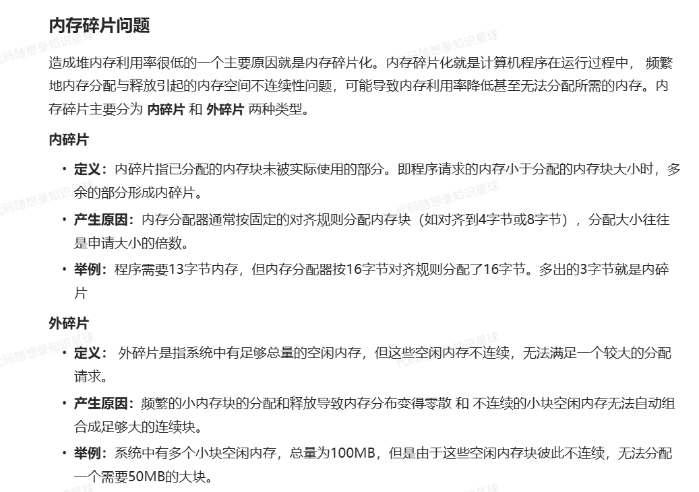
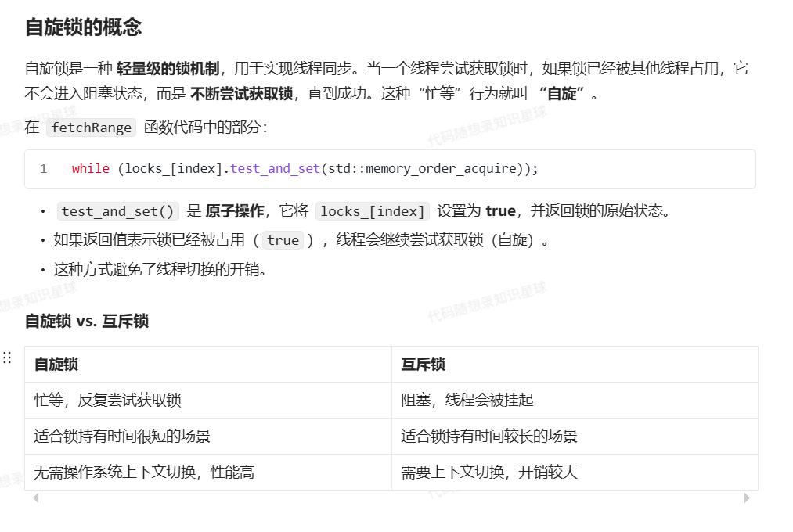

# 内存碎块


# 内存池在代码中的应用
对new/malloc/delete/free等动态开辟内存的系统调用进行替换
对STL众多容器中的空间配置器std::allocator进行替换
# 内存池的缺点
初始内存占用：内存池需要预先分配较大的内存区域，可能浪费一些内存。
复杂性：实现和调试内存池代码比直接使用 malloc / new 更复杂。
不适合大型对象：对于大对象的分配可能并不划算。

# 自旋锁

## reinterpret_cast<Slot*>(ptr)
Slot* slot = reinterpret_cast<Slot*>(ptr); //这行代码将一个未知类型的指针 ptr 转换为指向 Slot 类型的指针 slot
这种转换通常用于将一个通用指针（如 void*）转换为特定类型的指针，以便后续可以以 Slot 类型的方式访问和操作这块内存。

reinterpret_cast：这是C++中的一个强制类型转换操作符，用于低级别的类型转换。与 static_cast 不同，reinterpret_cast 不进行任何类型检查，它仅仅是对指针或引用的位模式进行转换。
这行代码使用了 reinterpret_cast 进行类型转换

## operator new /delete
```c++
   void* newBlock = operator new(BlockSize_);
```
operator new 是一个用于动态分配内存的全局函数。在这里，我们使用 operator new 来分配 BlockSize_ 字节的内存。
```c++
     operator delete(reinterpret_cast<void*>(cur));
```
operator delete 来释放当前内存块 cur 占用的空间,望的是一个 void* 类型的指针，它仅仅负责释放内存，而不调用对象的析构函数