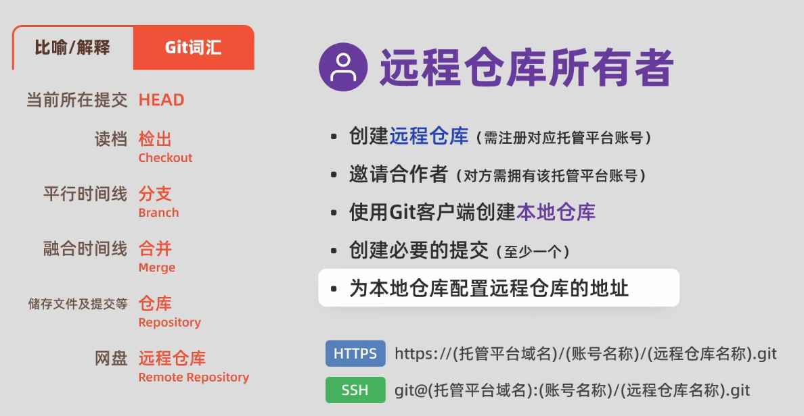
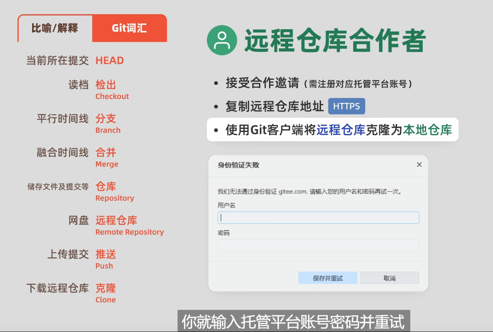
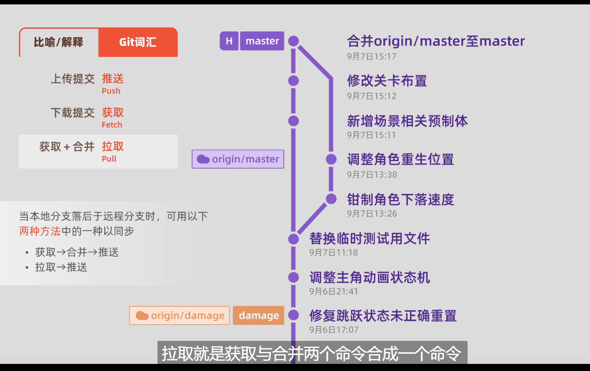

git Branch BranchName # 创建分支
git checkout BranchName # 切换分支
gitcheckout -b BranchName # 创建并切换分支
git branch -vv # 查看所有分支
git branch -d BranchName # 删除分支
git switch main #回到主分支
git merge  合并分支

git branch --set_upstream_to=origin/master master # 设置远程分支
之后就能在github上看到远程分支

git log 查看提交历史
git status 查看本地仓库当前状态

git pull//==git fecth+git merge //合并分支
区别：后者如果merge失败，会有报错，方便查找错误
* 分支合并后并不会自动删除分支，分支会继续自己的生命，需要手动删除
git pull //拉取远程分支到本地
# 个人流程
git add .
git commit -m "提交说明"
git push # 推送到远程仓库

# 团队流程
## 创建者

## 协作者

# 合作
