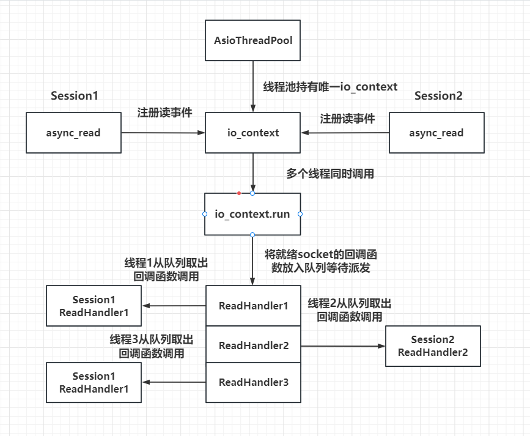

这个模型展示了一个基于 Boost.Asio 的异步事件处理和线程池配合的机制，具体流程如下：

核心组件：

线程池 AsioThreadPool：用来运行多个线程，这些线程同时调用同一个 io_context 实例的 run() 方法，从而提供并行处理能力。
io_context：核心事件循环，用于管理 I/O 服务。它接收异步事件（如 async_read 操作）的注册，并等待事件触发。
Session1 和 Session2：每个会话可能代表一个客户端连接，它们通过 async_read 等异步操作向 io_context 注册事件，并提供回调函数以供事件处理完成时调用。
关键流程：

异步事件注册：Session1 和 Session2 分别调用 async_read 注册异步读取事件到 io_context 中。
io_context.run() 执行：
线程池中的多个线程通过 io_context.run() 进入事件循环，等待事件发生。这些线程同时运作，以实现并发。
事件触发与任务分发：
当某个事件（如 async_read 的读完成事件）触发时，相关回调处理函数（如 ReadHandler1）被放入 io_context 的任务队列待派发。
回调处理：
各线程会从 io_context 的任务队列中取出回调函数进行处理，如调用 Session1 的 ReadHandler1 或 Session2 的 ReadHandler2。
因为有多个线程运行 io_context.run()，队列中的任务会被多个线程并发消费。
线程与任务的关系：

每个任务（如回调函数 ReadHandler）由线程池中的线程从 io_context 的队列中提取并执行。
多个任务可能属于不同的 Session，但在多个线程中同时处理。
优势：

提供异步非阻塞 I/O 操作，避免了阻塞操作占用线程资源。
通过线程池与 io_context 的协作，能够充分利用多核硬件，实现高并发处理。
总结：模型中的核心思想是异步事件驱动和多线程协同。其中 io_context 负责事件调度，线程池提供并发能力，Session 提供事件处理的上下文，而回调函数（如 ReadHandler）处理具体的任务逻辑。

# epoll
_service.run函数内部就是从iocp或者epoll获取就绪描述符和绑定的回调函数，进而调用回调函数，因为回调函数是在不同的线程里调用的，所以会存在不同的线程调用同一个socket的回调函数的情况

实现了一种高效的 I/O 多路复用机制：

1. 调用 epoll_create 创建 epoll 实例
2. 开辟一片包含 n 个 epoll_event 的连续空间
3. 注册要监听的 socket 到 epoll 表中
4. 调用 epoll_wait 获取就绪事件
epoll 只负责监听和通知就绪的事件（不主动进行数据读写）。
通过 epoll_wait 获取就绪事件，避免了传统 select/poll 每次遍历所有文件描述符的低效问题。