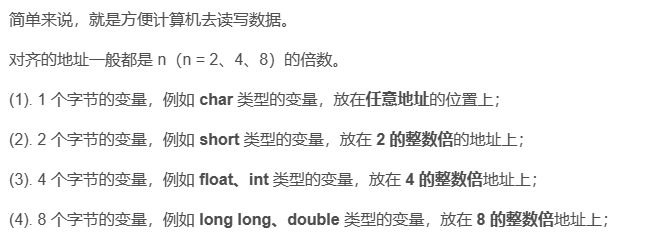
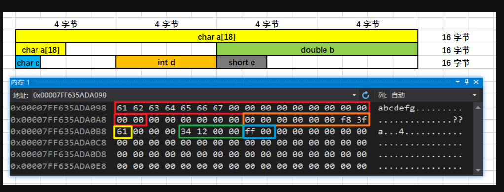
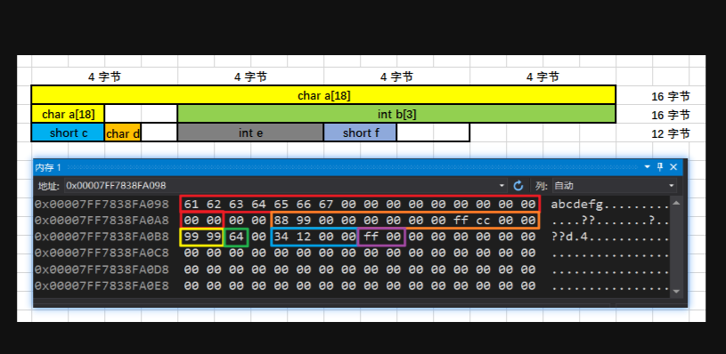

# 内存对齐

通常情况：我总结的规律如下：结构体中间：各结构体的起始地址按照各个类型变量默认规则进行摆放，但除了 char 类型变量（详见一），char 类型变量一般遵循 2 的倍数地址开始存储。
详见例2。结构体最后（重要）：视结构体中最大类型是哪一个，如果是像 int 类型那样是 4 个字节的，并且结构体的结尾地址不满足 4 的倍数的话，向离最近的 4 的倍数地址补齐；
如果是像 double 类型那样是 8 个字节的，并且结构体的结尾地址不满足 8 的倍数的话，向离最近的 8 的倍数地址补齐；以此类推。。。。

结构体嵌套：子结构体的成员变量起始地址要视子结构体中最大变量类型决定，比如 struct a 含有 struct b，b 里有 char，int，double 等元素，那 b 应该从 8 的整数倍开始存储

含数组成员：比如 char a[5]，它的对齐方式和连续写 5 个 char 类型变量是一样的，也就是说它还是按一个字节对齐

例1：
```c++
struct stu1 {
    char a[18];
    double b;
    char c;
    int d;
    short e;
};
```


例2：
```c++
struct stu1 {
    char a[18];
    int b[3];
    short c;
    char d;
    int e;
    short f;
};
```


例3： 研究数组的内存对齐
```c++
struct stu1 {
    int a;
    char b[8];
    float c;
    short d;
};
```      
    