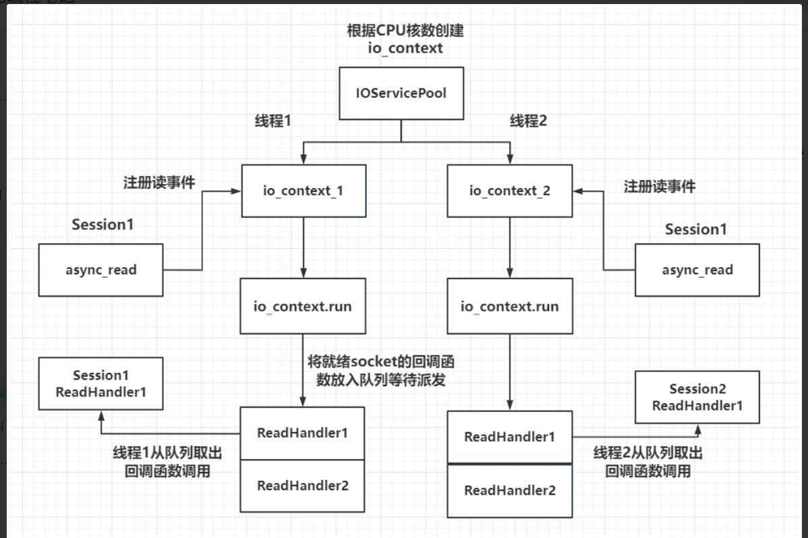
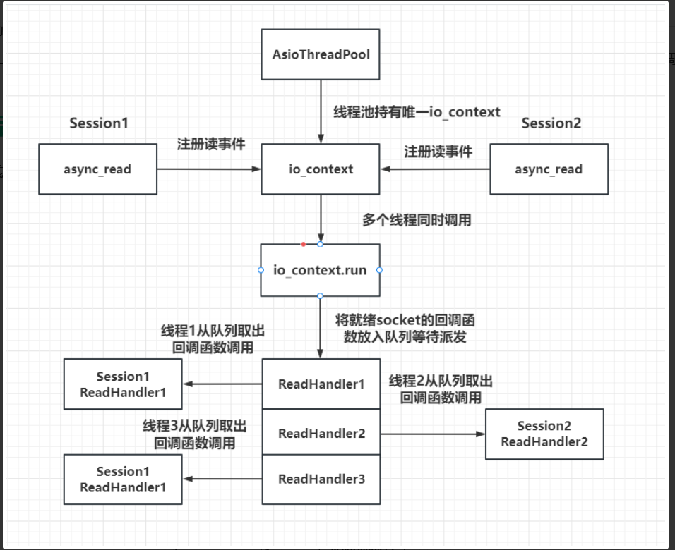
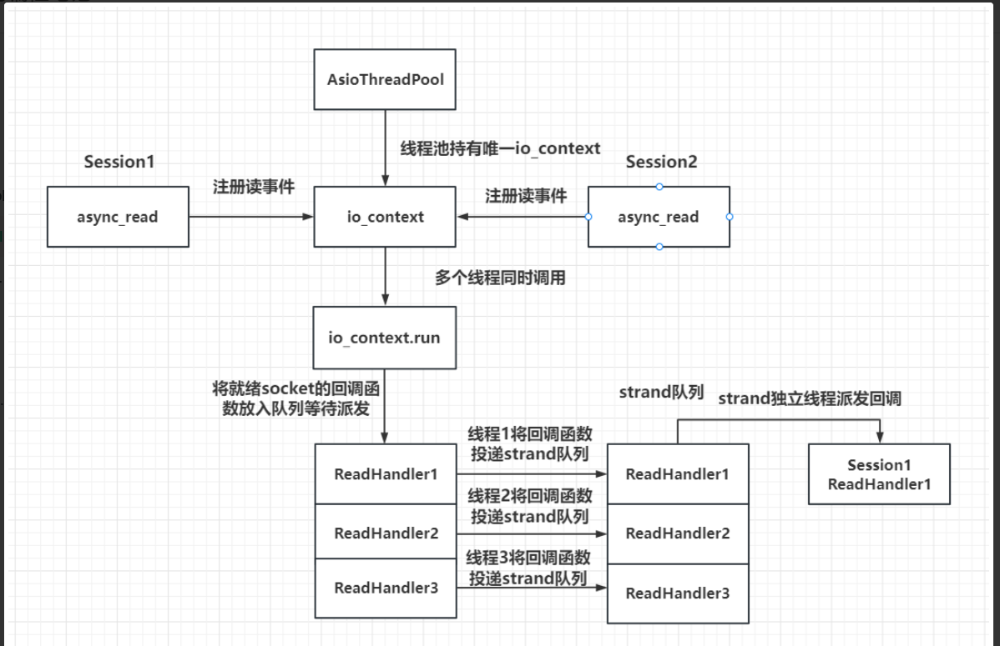

```c++
boost::asio::io_context  io_context;
boost::asio::signal_set signals(io_context, SIGINT, SIGTERM);
//创建一个信号集，绑定到io_context。这里监听的信号是SIGINT（通常是Ctrl+C产生的中断信号）和SIGTERM（终止信号）。这意味着当程序接收到这些信号时，会触发相应的操作。
signals.async_wait([&io_context](auto, auto) {//注册一个异步等待的回调函数。当接收到指定的信号时，这个函数会被调用
    io_context.stop();
    });
```
# 并行的AsioIOServicePool
我们介绍了IOServicePool的方式，一个IOServicePool开启n个线程和n个iocontext，每个线程内独立运行iocontext,
 各个iocontext监听各自绑定的socket是否就绪，如果就绪就在各自线程里触发回调函数。
 为避免线程安全问题，我们将网络数据封装为逻辑包投递给逻辑系统，逻辑系统有一个单独线程处理，
 这样将网络IO和逻辑处理解耦合，极大的提高了服务器IO层面的吞吐率

线程1里面注册的回调函数只会在线程1被调用，也就是说session1注册的回调只会在线程1被调用。

io_context.run底层使用iopc（linux里面是epoll）轮询事件，iocp/epoll模型轮询socket,检查是否有socket触发事件,有则处理事件,没有则继续轮询。
例如有读事件触发（客户端发送信息），就会把对应注册的读回调函数（readleHandler）放到就绪队列里面，按队列的顺序调用应用层回调函数。

1. 同一个socket会被注册在同一个io_context里，它的回调函数也会被单独的一个线程回调，那么对于同一个socket，他的回调函数每次触发都是在同一个线程里，就不会有线程安全问题，网络io层面上的并发是线程安全的

2. 但是对于不同的socket，回调函数的触发可能是同一个线程(两个socket被分配到同一个io_context，比如两个session都注册到线程1)，也可能不是同一个线程(两个socket被分配到不同的io_context里)。所以如果两个socket对应的上层逻辑处理，如果有交互或者访问共享区，会存在线程安全问题。比如socket1代表玩家1，socket2代表玩家2，玩家1和玩家2在逻辑层存在交互，比如两个玩家都在做工会任务，他们属于同一个工会，工会积分的增加就是共享区的数据，需要保证线程安全。可以通过加锁或者逻辑队列的方式解决安全问题，我们目前采取了后者。

3. 多线程相比单线程，极大的提高了并发能力，因为单线程仅有一个io_context服务用来监听读写事件，就绪后回调函数在一个线程里串行调用, 如果一个回调函数的调用时间较长肯定会影响后续的函数调用，毕竟是穿行调用。而采用多线程方式，可以在一定程度上减少前一个逻辑调用影响下一个调用的情况，比如两个socket被部署到不同的iocontext上，但是当两个socket部署到同一个iocontext上时仍然存在调用时间影响的问题。不过我们已经通过逻辑队列的方式将网络线程和逻辑线程解耦合（投递逻辑队列（网络线程）和逻辑队列处理（逻辑线程）是分开的线程）了，不会出现前一个调用时间影响下一个回调触发的问题。

## 单例模式使用模版
```c++
class AsioIOServicePool:public Singleton<AsioIOServicePool>
{
	friend class Singleton<AsioIOServicePool>;//让Singleton类可以访问私有构造函数
public:
private:
	AsioIOServicePool();//防止被外部实例化
};
```


c++11使用<chrono>头文件中的std::chrono::steady_clock::now()函数获取当前时间，精度为纳秒级。

# 并行的AsioIOthreadsPool
另一种多线程模式IOThreadPool，我们只初始化一个iocontext用来监听服务器的读写事件，包括新连接到来的监听也用这个iocontext。
只是我们让iocontext.run在多个线程中调用，这样回调函数就会被不同的线程触发，从这个角度看回调函数被并发调用了。
work相当于饭店管理者，io_context相当于饭店，线程相当于顾客；
io_context监听多个socket，每个socket都注册到iocontext上，iocontext将事件通知给线程池，线程池将事件分发给各个线程，每个线程处理事件。


AsioThreadPool(std::size_t size = std::thread::hardware_concurrency());//初始化线程池，默认使用CPU核数


构造函数中实现了一个线程池，线程池里每个线程都会运行_service.run函数，
_service.run函数内部就是从iocp或者epoll获取就绪描述符和绑定的回调函数，进而调用回调函数，因为回调函数是在不同的线程里调用的，
所以会存在不同的线程调用同一个socket的回调函数的情况。 _service.run 内部在Linux环境下调用的是epoll_wait返回所有就绪的描述符列表，
在windows上会循环调用GetQueuedCompletionStatus函数返回就绪的描述符，二者原理类似，进而通过描述符找到对应的注册的回调函数，
然后调用回调函数。
# iocp流程
1 创建完成端口(iocp)对象
2 创建一个或多个工作线程，在完成端口上执行并处理投递到完成端口上的I/O请求
3 Socket关联iocp对象(绑定)，在Socket上投递网络事件（注册事件）
4 工作线程调用GetQueuedCompletionStatus函数获取完成通知封包，取得事件信息并进行处理

# epoll流程
1 调用epoll_creat在内核中创建一张epoll表
2 开辟一片包含n个epoll_event大小的连续空间
3 将要监听的socket注册到epoll表里
4 调用epoll_wait，传入之前我们开辟的连续空间（作为参数传给epoll_wait），epoll_wait返回就绪的epoll_event列表，
epoll会将就绪的socket信息写入我们之前开辟的连续空间
线程调用回调函数会查询epoll_event列表，找到对应的socket，然后调用对应的回调函数

# strand改进
对于多线程触发回调函数的情况，我们可以利用asio提供的串行类strand封装一下，这样就可以被串行调用了，其基本原理就是在线程各自调用函数时取消了、
直接调用的方式，而是利用一个strand类型的对象将要调用的函数投递到strand管理的队列中，再由一个统一的线程调用回调函数，调用是串行的，解决了线程并发带来的安全问题。
图中当socket就绪后并不是由多个线程调用每个socket注册的回调函数，而是将回调函数投递给strand管理的队列，再由strand统一调
度派发。

为了让回调函数被派发到strand的队列，我们只需要在注册回调函数时加一层strand的包装即可。


在CSession类中添加一个成员变量
```c++
strand<io_context::executor_type> _strand;
```
CSession的构造函数
利用io_context.get_executor()返回的执行器构造strand。
在asio中无论iocontext还是strand，底层都是通过executor调度的，我们将他理解为调度器就可以了，如果多个iocontext和strand的调度器是一个，那他们的消息派发统一由这个调度器执行。
```c++
CSession::CSession(boost::asio::io_context& io_context, CServer* server):
    _socket(io_context), _server(server), _b_close(false),
    _b_head_parse(false), _strand(io_context.get_executor()){
    boost::uuids::uuid  a_uuid = boost::uuids::random_generator()();
    _uuid = boost::uuids::to_string(a_uuid);
    _recv_head_node = make_shared<MsgNode>(HEAD_TOTAL_LEN);
}
```
比如我们在Start函数里添加绑定 ，将回调函数的调用者绑定为_strand
```c++
void CSession::Start(){
    ::memset(_data, 0, MAX_LENGTH);

    _socket.async_read_some(boost::asio::buffer(_data, MAX_LENGTH),
        boost::asio::bind_executor(_strand, std::bind(&CSession::HandleRead, this,
            std::placeholders::_1, std::placeholders::_2, SharedSelf())));
}
```
Start()函数更新，我们创建了一个strand对象，并将回调函数绑定到strand对象上，这样回调函数就会被串行调用。
```c++
_socket.async_read_some(boost::asio::buffer(_data, MAX_LENGTH), boost::asio::bind_executor(_strand,std::bind( & CSession::HandleRead, this,
std::placeholders::_1, std::placeholders::_2, SharedSelf())));
```
# 工作线程与 io_context 和epoll 的关系
每个工作线程会循环地从io_context 中获取事件并进行处理。具体来说：

事件轮询：工作线程会调用io_context 的运行函数（如run、run_one、poll 等），这些函数会阻塞，直到有事件发生或超时。
事件处理：当io_context 检测到事件（通过epoll实例）时，它会将这些事件分发给相应的异步操作，并调用这些操作的回调函数。
并发处理：由于多个线程可以同时调用io_context 的运行函数，因此可以并发地处理多个事件。这提高了程序的并发处理能力。